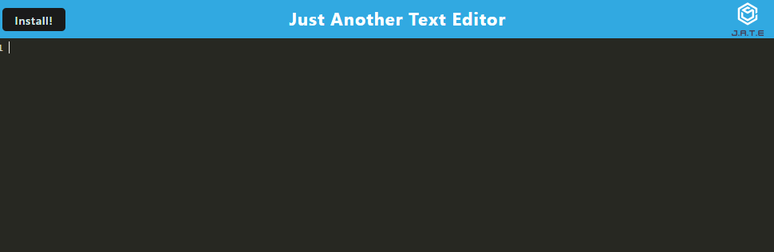

# text-editor

## User Story
AS A developer
I WANT to create notes or code snippets with or without an internet connection
SO THAT I can reliably retrieve them for later use

## Usage 
It features a number of methods that are useful for storing and retrieving data, and is used by companies like Google and Mozilla.

## Resources
Classmates! chat-gpt to help with command line errors

## Screenshot

## Deployed Link
https://ronithenewcoder.github.io/text-editor/